# Code Nest — BooksMarket

A Django web application for browsing and reading books. Register to save favorites, mark books as read, and access book files (PDF, EPUB, MOBI).

## Features

- **Browse books** by categories with pagination
- **Search** by title and author
- **User accounts** — registration, login, password reset via email
- **JWT authentication** — access and refresh tokens, logout with blacklist
- **Personal cabinet** — favorites and “read” list with API
- **Book files** — read online or download (authenticated users only)
- **Responsive UI** with theme support

## Screenshots

### Home

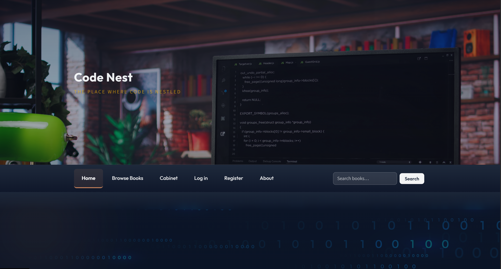

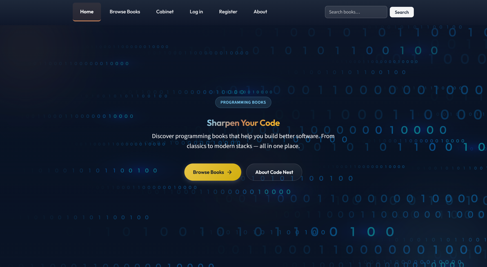

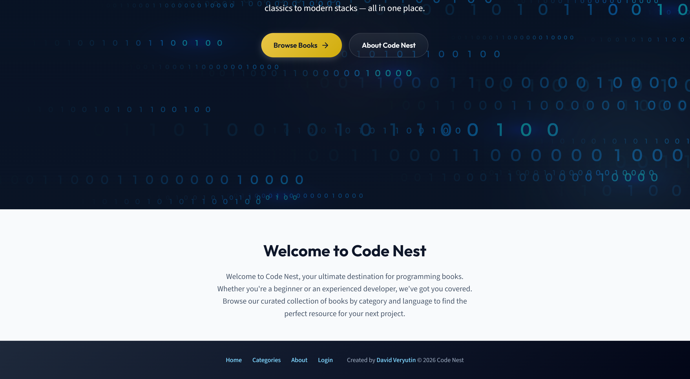

### Categories

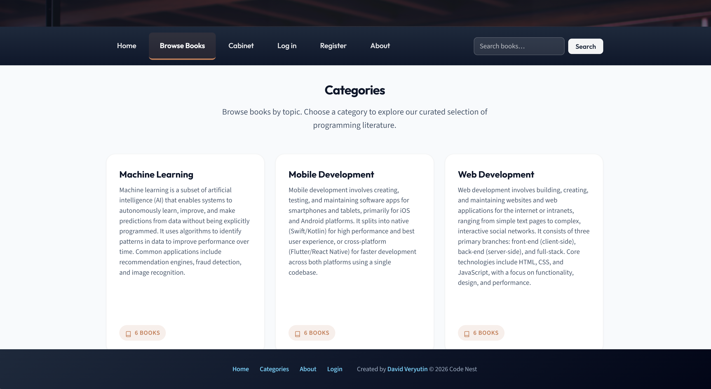

### Book list

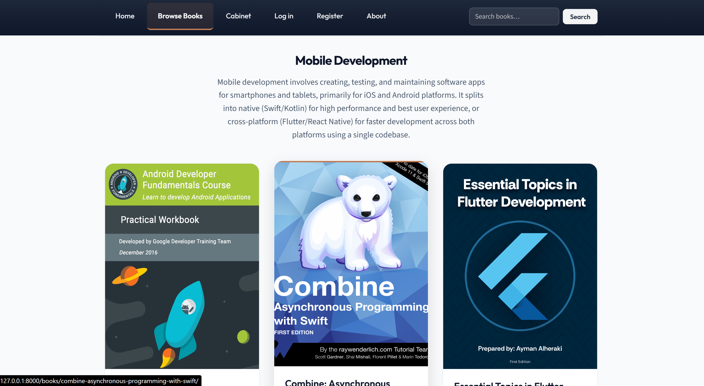

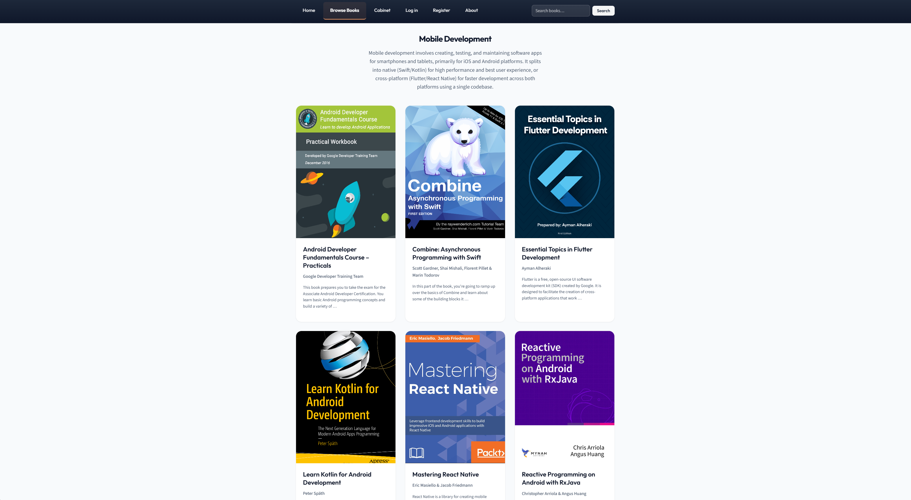

### Book details

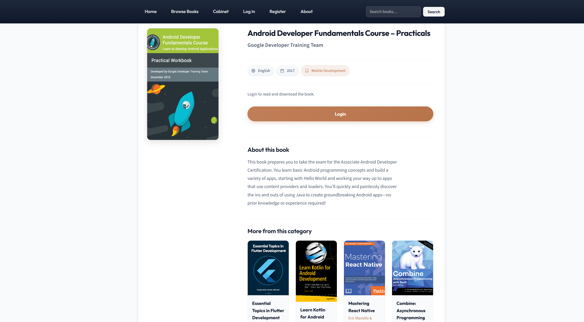

### Login and registration

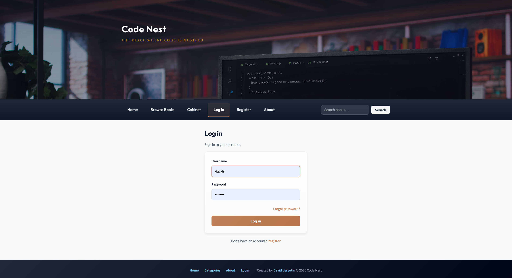

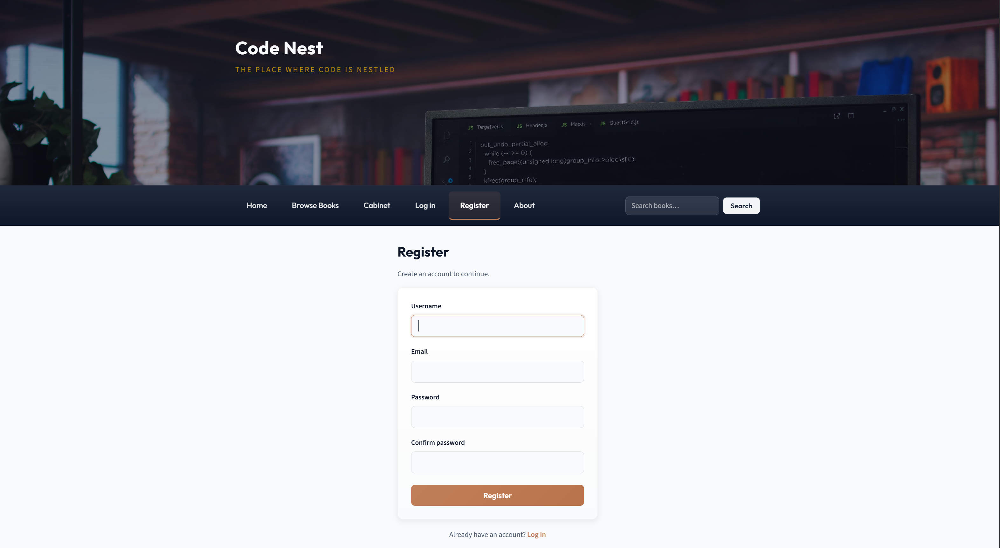

### Personal cabinet

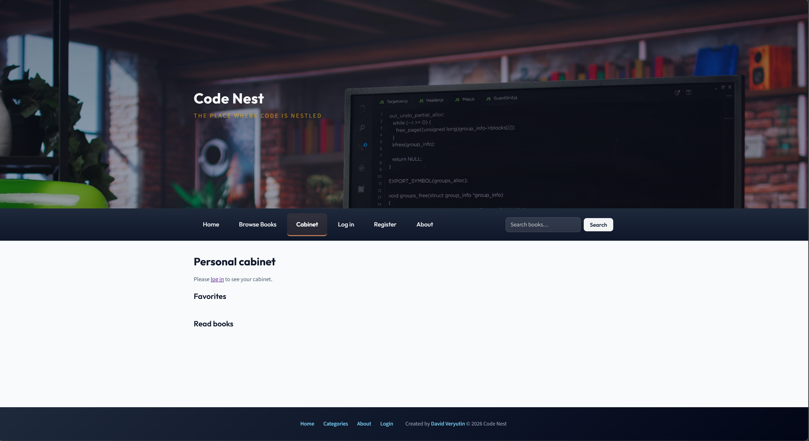

## Tech stack

- **Backend:** Django 5.x, Django REST Framework
- **Auth:** Simple JWT (access + refresh, token blacklist)
- **Database:** SQLite (default; configurable)
- **Frontend:** Server-rendered templates, vanilla JS, CSS

## Requirements

- Python 3.10+
- pip (or Pipenv; project includes `Pipfile` and `requirements.txt`)

## Quick start

### 1. Clone and enter the project

```bash
git clone <repo-url>
cd BooksMarket
```

### 2. Create a virtual environment and install dependencies

```bash
python -m venv .venv
.venv\Scripts\activate   # Windows
# source .venv/bin/activate   # Linux / macOS

pip install -r requirements.txt
```

### 3. Configure environment (optional for development)

Create a `.env` file in the project root or set variables in the shell. For local development you can leave defaults; for production set at least:

```env
DJANGO_SECRET_KEY=your-secret-key
DJANGO_DEBUG=False
ALLOWED_HOSTS=yourdomain.com,www.yourdomain.com
CORS_ALLOWED_ORIGINS=https://yourdomain.com
```

### 4. Run migrations and start the server

```bash
python manage.py migrate
python manage.py runserver
```

Open **http://127.0.0.1:8000/** in your browser.

### 5. Create a superuser (optional)

```bash
python manage.py createsuperuser
```

Then open **http://127.0.0.1:8000/admin/** to manage categories, books, and users.

## Project architecture

The project is a standard Django app with a config package, two main apps (web UI and REST API), and shared templates and static files.

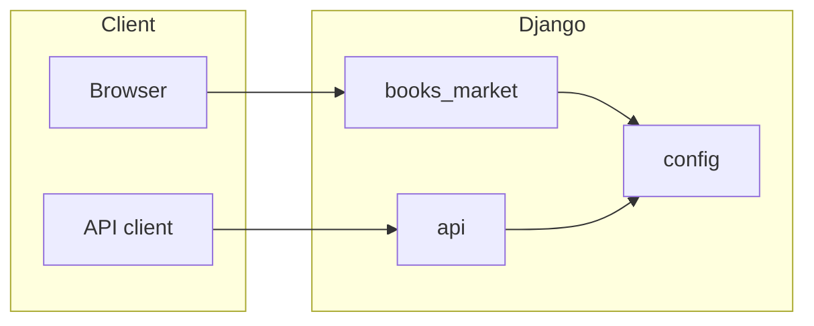

### Components

| Component | Role |
|-----------|------|
| **config** | Project settings, root URL config, WSGI/ASGI. Mounts `books_market` at `/` and `api` at `/api/`. |
| **books_market** | Main app: models (Category, Book, BookFavorite, BookRead, Language), server-rendered pages (home, categories, book list/detail, search, auth pages, cabinet), static assets. |
| **api** | REST API: JWT auth (register, login, refresh, logout, password reset), `/api/me/favorites/` and `/api/me/read/` for user lists. |
| **templates** | Global templates (base, 404, 500, email). App-specific templates live in `books_market/templates/`. |
| **static** | Global CSS/JS/images. App-specific static in `books_market/static/`. |
| **media** | User uploads: book covers and files (PDF, EPUB, MOBI). |
| **docs** | Documentation and screenshots. |

### Data model (high level)

- **Category** — title, slug, description. Books belong to one category.
- **Book** — title, slug, author, description, cover image, file, category, optional language.
- **BookFavorite** — user + book; used for “favorites” in cabinet and API.
- **BookRead** — user + book; used for “read” list in cabinet and API.
- **Language** — optional language for a book.

### URL layout

- `/`, `/search/`, `/about/`, `/categories/`, `/categories/<slug>/`, `/books/<slug>/`, `/books/<slug>/read/`, `/books/<slug>/download/` — web UI (books_market).
- `/register/`, `/login/`, `/forgot-password/`, `/reset-password/`, `/welcome/`, `/cabinet/` — auth and cabinet (books_market).
- `/api/auth/*`, `/api/me/favorites/`, `/api/me/read/` — REST API.
- `/admin/` — Django admin.

## Project structure

```
BooksMarket/
├── config/                 # Project settings, root urls, wsgi, asgi
├── books_market/           # Main app: models, views, templates, static
│   ├── migrations/
│   ├── static/books_market/
│   └── templates/books_market/
├── api/                    # REST API: auth, me/favorites, me/read
├── templates/              # Global templates (base, 404, 500, email)
├── static/                 # Global static (CSS, JS, images)
├── media/                  # Uploads (book covers, files)
├── docs/                   # Documentation and screenshots
│   └── screenshots/
├── manage.py
├── requirements.txt
└── Pipfile
```

## Environment variables

| Variable | Description | Default (dev) |
|----------|-------------|----------------|
| `DJANGO_SECRET_KEY` | Secret key for Django (required in production) | Insecure fallback when `DEBUG=True` |
| `DJANGO_DEBUG` | Enable debug mode | `True` |
| `ALLOWED_HOSTS` | Comma-separated hosts | `localhost,127.0.0.1` when DEBUG |
| `CORS_ALLOWED_ORIGINS` | Comma-separated CORS origins (when `DEBUG=False`) | — |
| `EMAIL_BACKEND` | Email backend (e.g. `django.core.mail.backends.smtp.EmailBackend`) | Console backend |
| `EMAIL_HOST`, `EMAIL_PORT`, `EMAIL_USE_TLS` | SMTP settings | — |
| `EMAIL_HOST_USER`, `EMAIL_HOST_PASSWORD` | SMTP credentials | — |
| `DEFAULT_FROM_EMAIL` | From address for emails | `noreply@booksmarket.local` |
| `FRONTEND_RESET_URL` | Base URL for the password reset link in email. Use the same origin when using built-in pages, e.g. `http://127.0.0.1:8000/reset-password/`. | `http://127.0.0.1:8000/reset-password/` |

## API overview

All API responses are JSON. Authenticated endpoints require header: `Authorization: Bearer <access_token>`.

| Method | Endpoint | Description |
|--------|----------|-------------|
| POST | `/api/auth/register/` | Register (username, email, password, password_confirm) |
| POST | `/api/auth/token/` | Login → `{ access, refresh }` |
| POST | `/api/auth/token/refresh/` | Refresh → `{ access }` |
| POST | `/api/auth/logout/` | Logout (body: `{ refresh }`, blacklists token) |
| GET | `/api/auth/me/` | Current user (authenticated) |
| POST | `/api/auth/password/reset/` | Request password reset (body: `{ email }`). Web UI: [/forgot-password/](/forgot-password/) |
| POST | `/api/auth/password/reset/confirm/` | Confirm reset (uid, token, new_password, new_password_confirm). Link in email opens [/reset-password/?uid=…&token=…](/reset-password/) |
| GET / POST | `/api/me/favorites/` | List or add favorite (POST body: `{ book_slug }`) |
| DELETE | `/api/me/favorites/<slug>/` | Remove favorite |
| GET / POST | `/api/me/read/` | List or add “read” (POST body: `{ book_slug }`) |
| DELETE | `/api/me/read/<slug>/` | Remove from read list |

## Production checklist

- Set `DJANGO_SECRET_KEY` and `DJANGO_DEBUG=False`
- Set `ALLOWED_HOSTS` and `CORS_ALLOWED_ORIGINS`
- Use a production database (e.g. PostgreSQL) and configure static/media storage as needed
- Serve over HTTPS; the app sets secure cookies and HSTS when `DEBUG=False`
- Configure SMTP and `FRONTEND_RESET_URL` for password reset emails. When using the built-in login and reset-password pages, keep the default or set `FRONTEND_RESET_URL` to your site’s reset page (e.g. `https://yourdomain.com/reset-password/`).

## License

MIT. See repository for details.
